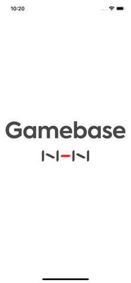
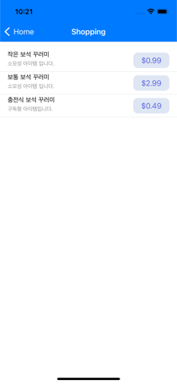
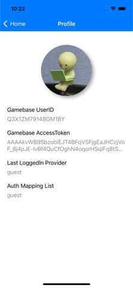
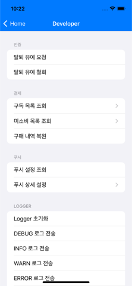

# Gamebase Sample App for iOS

Gamebase SDK 적용 시 기본적인 흐름을 참고할 수 있는 Sample App입니다. 이 App을 통해 Gamebase SDK를 좀 더 쉽게 적용할 수 있습니다.

[Gamebase iOS SDK 연동 가이드](https://docs.toast.com/ko/Game/Gamebase/ko/ios-started/)

[](https://cocoapods.org/pods/Gamebase)

## Requirements

* Xcode 14.x
* iOS 11.0+
* Swift 5

## Gamebase iOS SDK Release Notes

* https://docs.toast.com/ko/Game/Gamebase/ko/release-notes-ios/

## Start Sample App

1. clone repository

```bash
$ git clone https://github.com/nhn/toast.gamebase.ios.sample.git
```

2. `GamebaseSampleApp` 폴더로 이동한 후에 Pod을 설치해 줍니다.

```bash
$ pod install
```

3. `GamebaseSampleApp.xcworkspace`를 열어서 실행합니다.

## Contents


| Screenshot | Description | 
| :---: | --- | 
| IntroViewController<br> | Sample App 초기화면입니다.<br>Gamebase SDK 초기화, 약관 동의 화면 출력, 자동 로그인 등 앱이 정상적으로 동작할 수 있도록 사전작업을 합니다. |
| LoginViewController<br> | 로그인 화면입니다.<br>Guest 로그인을 포함하여 다양한 외부 IdP를 선택할 수 있습니다. |
| HomeViewController<br> | Sample App의 메인 화면입니다.<br>왼쪽 상단의 메뉴 버튼을 클릭하면 다른 화면으로 이동할 수 있습니다. |
| ShoppingViewController<br> | 아이템 조회 및 아이템 구매를 할 수 있는 화면입니다. |
| ProfileViewController<br> | Gamebase 계정에 대한 정보를 보여주는 화면입니다. (UserID, AccessToken 등) | 
| SettingsViewController<br> | 계정 관리, 알림, 기타 등 Sample App의 전반적인 설정을 관리하는 화면입니다. |
| DeveloperViewController<br> | Sample App에서 직접적으로 사용하지 않거나 Configuration을 통해 추가 설정이 가능한 Gamebase SDK API를 호출해 볼 수 있는 화면입니다. |

## Gamebase Console Settings

Sample App의 모든 기능을 사용하기 위해서 NHN Cloud Console에 신규 프로젝트를 등록하고 Gamebase 서비스를 활성화 합니다.

### App

앱, 클라이언트 상태를 설정합니다.
* [Gamebase Guide - App](http://docs.toast.com/ko/Game/Gamebase/ko/oper-app/)

### IdP Settings

인증 정보를 추가합니다.

* [Gamebase Guide - Authentication Information](http://docs.toast.com/ko/Game/Gamebase/ko/oper-app/#authentication-information)

### Operation

앱 운영 시 사용합니다. 공지, 점검 등을 등록할 수 있습니다.

* [Gamebase Guide - Operation](http://docs.toast.com/ko/Game/Gamebase/ko/oper-operation/)

### Push Settings

앱 이용자에게 푸시 알림을 발송할 수 있고, 발송 이력과 등록된 푸시 예약 목록을 확인할 수 있습니다.

* [Gamebase Guide - Push](http://docs.toast.com/ko/Game/Gamebase/ko/oper-push/)

### Payment Settings

인앱 결제와 관련된 정보를 등록하고 내역을 조회할 수 있습니다.

* [Gamebase Guide - Payment](http://docs.toast.com/ko/Game/Gamebase/ko/oper-purchase/)

### Customer Service

게임 운영 중 유저에게 인입된 문의를 처리할 수 있으며 그 외 고객센터 페이지를 통해 제공할 수 있는 공지사항, FAQ 등의 설정을 관리할 수 있습니다.

* [Gamebase Guide - Customer Service](https://docs.toast.com/ko/Game/Gamebase/ko/oper-customer-service/)